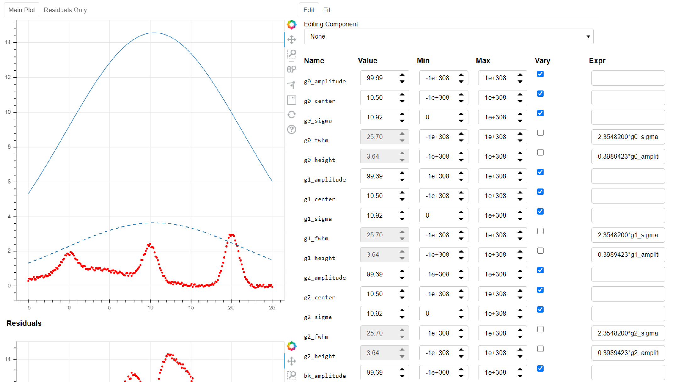

= Prototype Interactive 1D Fitting
Jonathan Okasinski

This project's aim is to improve the ergonomics and speed of 1D curve fitting by accelerating common fitting tasks with minimal change to existing workflows.
This is accomplished via interactive viewing of fits and selection of initial parameters.

One application of this fitting speedup is to perform a large number of fits, then quickly fix the handful of regressions that fail.
It's also worth keeping in mind that:

[quote, Sol Gruner, Professor Emeritus at Cornell University]
How often one does something is related to how easy it is to do.

== Usage Concept
This project is designed for:

* Interactive command-line usage
* Integration into larger data analysis workflows
* Jupyter notebook usage footnote:[Not a primary goal; see `igs.panel` if you are interested]

The command-line workflow might look like this:

* Fit and preprocess your data at the command line.
* Launch an interactive GUI to perform your fit, without blocking the command line.
The GUI is purely an extra layer to accelerate certain graphical tasks.
Anything that you're used to doing at the command line you can continue to do identically, with the GUI reflecting your changes.
* Close the GUI, with the fit results now contained in your terminal

== Technologies
We use `lmfit` for fitting and the holoviz ecosystem for interactivity.
That's primarily `bokeh`, `panel`, and `param`, which are browser based.
This enables:

* Rich interactivity
* Cross-platform functionality
* Simple cross-platform remote use via port forwarding
* Easy integration into Jupyter notebook and other web tools

== Installation
* `git clone https://github.com/nitrocalcite/interactive_1d_fitting`
* `pip install -r requirements.txt`
* Have fun!

== Usage Tutorial
_tl;dr_ `from lmf_gui import IGaussianModel; igs = IGaussianModel().interactive_guess(y, x)`
Then see `igs.model`, `igs.params`, `igs.fit`, `igs.set_model`, `igs.set_data`.

This project extends lmfit's models with an `InteractiveModelMixin`.
Interactive models have an `interactive_guess` method, which is the primary GUI entry point.
Its arguments are modeled after lmfit's `guess`.

Let's say you run the provided `gaussian_sum_example.py` by doing:
[source, Python]
from examples.gaussian_sum_example import *

Here's the script:
[source, Python]
----
import numpy as np
from lmf_gui.models import IGaussianModel

# construct data - 3 gaussian peaks with noise, against a broad gaussian background
x = np.linspace(-4, 4, num=75)
y = np.exp(-x ** 2)
x = np.linspace(-5, 25, num=75 * 3)
y = np.concatenate([y, 2 * y, 3 * y])
y += (np.random.random(len(x)) - 0.5) / 5
y += np.exp(-np.linspace(-1, 3, num=75 * 3) ** 2)

# construct model that is sum of 4 Gaussians
cm = IGaussianModel(prefix="g0_") + IGaussianModel(prefix="g1_") + \
     IGaussianModel(prefix="g2_") + IGaussianModel(prefix="bk_")

# launch interactive guess session with this data & model
igs = cm.interactive_guess(y, x)
----

Your terminal now has an `InteractiveGuessSession` object named `igs`.
This represents the current state of the fitting and the GUI.
`interactive_guess` will also open the GUI in your browser:

In the left hand graph, we have:

* Data points to fit (red dots)
* Full model (solid blue line)
* Model components (dashed blue lines)

Underneath this is a graph of the residuals, with the same style.
On the right hand side, we have:

* A dropdown to select which model component to edit graphically (at top)
* A table allowing manual variation of the parameters used as the initial guess for the model
* A button to perform a fit and show the results (accessible via center-right hand tab)

Now, there are a couple ways to edit parameters:

Via the command-line::
Access the lmfit `Parameters` directly with `igs.params`.
Edit them with i.e. `igs.params['g0_sigma'].value = 10`.

Via the table::
Enter numbers directly in the interactive table.
You can also hover the fields with the mouse and use the scroll wheel.

Via the graph::
Select a model component to edit from the dropdown.
Activate Bokeh's PolyEditTool (graph toolbar, triangle icon).
Double click on the line that appears, then drag the vertices.
Dragging these handles will change the shape of the model component.

[WARNING]
.You may need a special version of Bokeh for the graph editing
There's currently a https://github.com/bokeh/bokeh/issues/10670[bug in Bokeh] that causes the graph editing to break.
After performing one drag, you'll have to double click the line before dragging again.
A patch is available if you install Bokeh from https://github.com/nitrocalcite/bokeh[my fork]

All these methods are fully equivalent and kept in sync with each other at all times.

Now that you have established an initial guess, you can perform a fit by:

Press the button::
Go to the "Fit" tab in the upper center of the GUI, and click the "Fit" button.
An indicator lets you know when the fit is finished, and a fit report will appear.

Type the command::
`igs.do_fit()`

Again, these methods are fully equivalent and synced with the GUI; all the graphs & tables will automatically update.
The results of the last fit will be available as a lmfit `ModelResult` object from `igs.fit`.
Among other things this object contains the model, initial parameters, best guess parameters, and calculated uncertainties.

You can save or load these objects:
[source, Python]
from lmf_gui import load, save
result = save(igs.fit, "fit.json")
result = load("ModelResult", "fit.json")

`save` and `load` can also work with the Parameters or Model directly.

Now that you've finished one fit, perhaps perform a similar operation with slightly different data or modeling.
You can interactively swap out the data, the model, or the parameters:

* `igs.set_data(y, x=None)`  If x is None, your data will be numbered
* `igs.set_model(model, params=None)`  If params is None, `model.guess` will be used.
If `model.guess` is not supported, you are required to provide parameters.
* `igs.set_params(params)`

There is also (experimental) support for in-place modification of the Parameters dictionary:
[source, Python]
igs.params.add('spacing', value=20)

You might use this to say, add a new parameter representing the spacing between Gaussian peaks.
This also allows you to directly load saved parameters:
[source, Python]
save(igs.params, "good_params.json")
...
with open("good_params.json", "r") as f:
    igs.params.load(f)

Parameters in lmfit are also entirely independent of the model objects.
They can be set to algebraic combinations of each other (see `Parameter.expr`).
In addition to constraining your fits, this may be particularly useful for directly reporting final values:
[source, Python]
igs.params.add('noise_adu', expr='g0_sigma * 22')

Now, your noise in ADU will show up directly in the fit report with an accompanying uncertainity.

[NOTE]
We borrow all of lmfit's terminology and concepts about fitting.
If you are not familiar, their https://lmfit.github.io/lmfit-py/model.html[documentation] may be instructive.

=== Potential Concerns
How do components know how to draw themselves?  What if I use my existing components?::
Each model component is responsible for implementing its own draggable graph interface (see `lmf_gui.models`).
If your model contains non-interactive model components, such as those from lmfit, you will not be able to use the graph editing feature.
However, the rest of the interactive features will work fine.

== Licensing
This code has been authored by Jonathan Okasinski and is made available under the terms of the GNU GPLv3 license.
